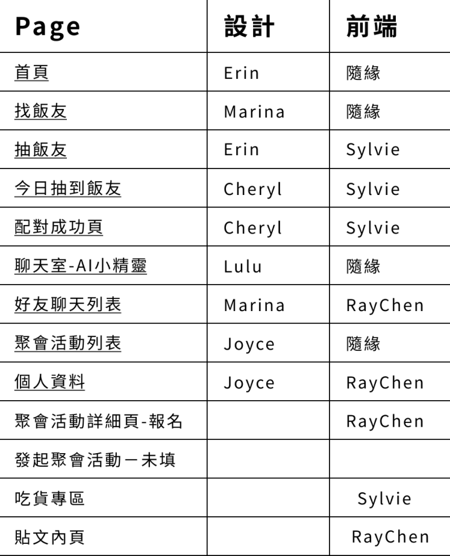
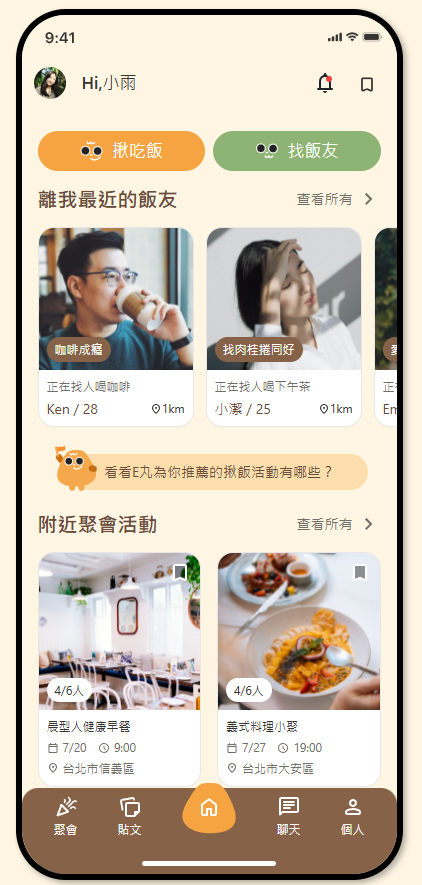
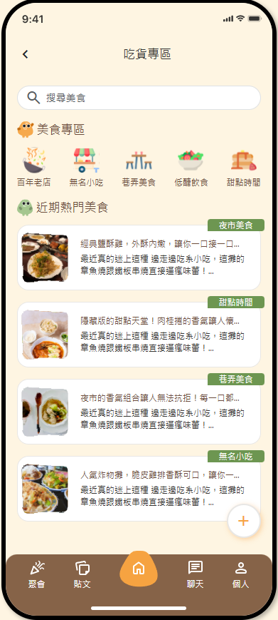

# Eaterhood

##  專案介紹

此專案為 **2025 AAPD x 六角學院 設計前端產品研發營** 之前端切版作品。

用一頓飯 找到你的交友圈。

> 背景：近年來，交友軟體偏向滑動配對與即時反饋，雖提高使用黏著度，卻難以建立真實關係。隨著疲乏感累積，越來越多使用者渴望回歸真誠，有深度的實體互動。

> 目標：吃飯不只是生理需求，更是最能打開話匣子的行為。希望透過我們的產品幫助用戶自然建立連結。

## 🎨 設計稿 & 設計師 (AAPD)

- Cheryl
- Erin
- Lulu
- Marina
- Joyce

## 💻 前端人員 (六角學院)

- [sylvie0109](https://github.com/sylvie0109)
- [zuien-kk](https://github.com/zuien-kk)
- [RayChen1996](https://github.com/RayChen1996)

## 🚀 畫面介紹

### 首頁

### 吃貨專區

